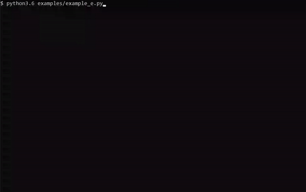

# Guess Testing

Welcome to Guess Testing!

Ain't nobody got the time to write unit tests! But... everybody wants a 100% coverage! If you're not a QA person (or
even if you do), this here solution is just PERFECT for you!

Test your code with Guess Testing! No more hard work searching for edge cases, possible exceptions, or immunity to weird
inputs. Save your strength and let the CPU do the hard work.

## Getting Started

First off clone this project, it is written for [Python 3.6.8](https://www.python.org/downloads/release/python-368/),
but due to its basic requirements can work on many other versions.

### Prerequisites

No additional packages are required for using Guess Testing, but for a pretty progress bar, `rich` is required.

```shell script
pip install rich
```

### Installing

You can install Guess Testing using PyPI!

```shell script
pip install guess-testing
```

That's it!

### Usage

Guess Testing is package that can be imported and used for many reasons, such as:

1. Finding the smallest set of parameters for getting a full coverage of a scope.
2. Finding the possible exceptions the code can throw and from where, and which arguments cause these behaviors.
3. Finding all the possible return values of a function, and which arguments cause them.
4. Any form of stress testing, analysing an unknown code, and many, many more cases.

As a python package, it is importable, like so:

```python
import guess_testing
```

Guess Testing offers two main features that can be used separately, guessing and generators:

* **Guessing** - The ability to guess values for a function until specific requirements are met.
* **Generators** - The ability to generate values using explicitly constructed generators (many generators are
  available), or using the factory and retrieving a generators that correlates to the type annotation specified, or a
  function, *supports `typing` module type specifications*.

### Test Run

#### Guessing

Let's see an example of how Guess Testing can be of benefit:

```python
import typing

from guess_testing.guess import Guesser, StopConditions


def e(a: typing.List[int]) -> str:
    if len(a) == 0:
        return 'no enough'
    if len(a) == 1:
        return 'still not enough'
    if a[0] == a[1]:
        return 'wow!'
    if a[0] % a[1] == 0:
        return 'great!!'
    if a[0] % a[1] == 1:
        return 'amazing!!!'
    return 'boo...'


gg = Guesser(e)
gg.guess(stop_conditions=StopConditions.FULL_COVERAGE, suppress_exceptions=ZeroDivisionError, pretty=True)
print(gg.coverage)
print(gg.exceptions)
print(gg.return_values)
```

Now all that's left is running the code, let's see it in action!



> The code in this example run can be found in [Example E](examples/example_e.py).
>
> More examples are available [here](examples).

#### Generators

Let's review two more examples using the generators' ability (taken from [Example F](examples/example_f.py)):

```python
import typing

from guess_testing.generators import TypingGeneratorFactory


def e(a: typing.List[int]) -> str:
    pass


generators = TypingGeneratorFactory.get_generators(e)
print(generators)

for _ in range(10):
    print(generators['a']())
```

Now the result:

```text
{'a': <class 'guess_testing.generators.ListGenerator'>({'sub_generator': <class 'guess_testing.generators.IntGenerator'>({'start': -65536, 'stop': 65536, 'step': 1}), 'min_length': 0, 'max_length': 16})}
[39784, 47413, 20590, 47366, -47725, 60081, 41957]
[35520, 54323]
[47232, -18372]
[-28274, 30664, -65376, 41264, -25118, 1267, -46631, 15847, 64907, 14002, -26615, 37780]
[]
[26879, -9958, 12824]
[-32159, -23371, -46221, 40098, 42298, 60795]
[-8062, 64305, -14024, 46788]
[-62397, 12193, -48413, -45434, -56422, -45250, 24665, 37593, -4881, -40823, 48727, 43525]
[18760, -36428, -34772, -41072, 50803, 54740, -25575, 1038, 57881, -10428, -4403, 738, -6967, -48162, 19645]
```

Here's another one, a bit more extreme ([Example G](examples/example_g.py)):

```python
from guess_testing.generators import AnyGenerator

for _ in range(5):
    a = AnyGenerator()
    print(a)
    print(a())
```

The output:

```text
<class 'guess_testing.generators.AnyGenerator'>({'sub_generator': <class 'guess_testing.generators.IntGenerator'>({'start': -65536, 'stop': 65536, 'step': 1})})
-62120
<class 'guess_testing.generators.AnyGenerator'>({'sub_generator': <class 'guess_testing.generators.DictGenerator'>({'keys_generator': <class 'guess_testing.generators.TupleGenerator'>({'sub_generators': [<class 'guess_testing.generators.TupleSequenceGenerator'>({'sub_generator': <class 'guess_testing.generators.OptionalGenerator'>({'null_chance': 0.5, 'sub_generator': <class 'guess_testing.generators.FloatGenerator'>({'start': -65536, 'stop': 65536, 'step': None})}), 'min_length': 0, 'max_length': 16}), <class 'guess_testing.generators.IntGenerator'>({'start': -65536, 'stop': 65536, 'step': 1}), <class 'guess_testing.generators.FloatGenerator'>({'start': -65536, 'stop': 65536, 'step': None}), <class 'guess_testing.generators.BytesGenerator'>({'min_length': 0, 'max_length': 32, 'selection': 'ABCDEFGHIJKLMNOPQRSTUVWXYZabcdefghijklmnopqrstuvwxyz0123456789!@#$%^&*()-=_+{}[]\\|/<>\'"`~;.,\n\t ', 'encoding': 'utf-8'}), <class 'guess_testing.generators.StringGenerator'>({'min_length': 0, 'max_length': 32, 'selection': 'ABCDEFGHIJKLMNOPQRSTUVWXYZabcdefghijklmnopqrstuvwxyz0123456789!@#$%^&*()-=_+{}[]\\|/<>\'"`~;.,\n\t '}), <class 'guess_testing.generators.RangeGenerator'>({'minimum': -256, 'maximum': 256, 'min_step': -16, 'max_step': 16}), <class 'guess_testing.generators.IntGenerator'>({'start': -65536, 'stop': 65536, 'step': 1})]}), 'values_generator': <class 'guess_testing.generators.FloatGenerator'>({'start': -65536, 'stop': 65536, 'step': None}), 'min_length': 0, 'max_length': 16})})
{((None, None, -31218.120656494502, -17959.246456759312), 18844, -36497.62008629234, b'@+gj0a$VQ})>\t3b', '[#*S\ttP.kijTjPinCL[x@~G', range(-150, 85, 4), -22609): -2753.3163967675646, ((None, 22380.352679471514, None, -30715.38823144007, -13639.682677621648), 52901, 42026.17586239865, b'K>SS', 'i Sx', range(254, 256), 43473): -50171.31441729225, ((42418.67698765673, 60727.85592718632, None, 30204.266333817242, None, None, 34683.63570338827), -60543, 65411.671916133884, b'!QJpHrxK[o)h5WE', "%+4*M@]m&75\tGrqhk',{X{wG$W", range(250, 247, -3), -49808): -17792.082599884845, ((-754.2874423457979, None, None), -25765, 44613.86041063866, b'y&d!PTk+q J_5svT\n v#1__M1jrl', "'liXAz;2QyE6 UKGS'Sn", range(-116, -110, 5), -12736): -453.63983029361407, ((62475.20619005145,), 43266, -735.5069975106162, b'qj8', '20\\=\t5S[e-', range(176, 202, 7), 34797): 47082.9806970971, ((-49597.69901118174, 24281.924525327224, -39727.62432493175, None, 15474.882482244459, None, 56708.90446773372, None, -2028.1454724828363, None), 54249, -65321.76802026463, b'V"W', 'nR!8Ow>Z{', range(163, 39, -6), 36126): -60349.46740214282, ((None, None, 40027.84536000319, None, None, -3271.8292052215256, None, -46193.27643105152, 44654.03978352995, None, -27995.2670976964, 16029.742935436952), -30605, 10525.551441432443, b'S.{XLri}s\\<fI8;G^I', 'i"n\tK,{ 7=o2C-c', range(-85, 134), -16668): 11194.025411883325, ((None, -23277.312506368165, 34900.860586628216, None, -62065.24025203368), -1115, -34966.58791142794, b'rM$B ^KN)iYU^P', '#4=<i"8/3W\'wRd^uumh{f>r37Ei', range(-174, 249, 14), -52121): 14009.93670378052, ((-18062.321105094015,), 41094, 15720.1485980523, b"|F|=o#eoq_$[Ocu#KN-<1s*c['SK1e8%", '<w0*9>s@ 3K-[|U1M\\RRC./E%Br)Y(', range(133, 253, 4), 43026): -19331.179927800185}
<class 'guess_testing.generators.AnyGenerator'>({'sub_generator': <class 'guess_testing.generators.SequenceGenerator'>({'sub_generator': <class 'guess_testing.generators.DictGenerator'>({'keys_generator': <class 'guess_testing.generators.StringGenerator'>({'min_length': 0, 'max_length': 32, 'selection': 'ABCDEFGHIJKLMNOPQRSTUVWXYZabcdefghijklmnopqrstuvwxyz0123456789!@#$%^&*()-=_+{}[]\\|/<>\'"`~;.,\n\t '}), 'values_generator': <class 'guess_testing.generators.TupleSequenceGenerator'>({'sub_generator': <class 'guess_testing.generators.IntGenerator'>({'start': -65536, 'stop': 65536, 'step': 1}), 'min_length': 0, 'max_length': 16}), 'min_length': 0, 'max_length': 16}), 'min_length': 0, 'max_length': 16})})
<generator object SequenceGenerator.__call__.<locals>.<genexpr> at 0x7f3a7cab0938>
<class 'guess_testing.generators.AnyGenerator'>({'sub_generator': <class 'guess_testing.generators.SetGenerator'>({'sub_generator': <class 'guess_testing.generators.FloatGenerator'>({'start': -65536, 'stop': 65536, 'step': None}), 'min_length': 0, 'max_length': 16})})
{-51512.69779291573, -35551.63467655475, 18643.998712905508}
<class 'guess_testing.generators.AnyGenerator'>({'sub_generator': <class 'guess_testing.generators.BytesGenerator'>({'min_length': 0, 'max_length': 32, 'selection': 'ABCDEFGHIJKLMNOPQRSTUVWXYZabcdefghijklmnopqrstuvwxyz0123456789!@#$%^&*()-=_+{}[]\\|/<>\'"`~;.,\n\t ', 'encoding': 'utf-8'})})
b'3o;u'
```

## Technologies and Capabilities

* Guess Testing is written in [Python 3.6.8](https://www.python.org/downloads/release/python-368/).
* Does not require any additional packages.
* Features a pretty progress bar for enhanced satisfaction.
* Very lightweight.
* Flexible guessing stop conditions, like full coverage, an exception is thrown, certain time has passed, call count
  limit is reached...
* Allows getting information by coverage, return values, and exceptions.
* Easily extendable.
* What more can I say? It's small, standalone, and can actually be of use.

## Documentation

The code is documented using [Google Python Style Guide](https://google.github.io/styleguide/pyguide.html) format.

I hope that it can answer whichever questions that may arise.

## Contributing

Feel free to contact me if you have any comments, questions, ideas, and anything else you think I should be aware of.
Also, tell me what legendary matches have been played with Chess, or how playing against Stockfish improved your
strategy, I'd love to know.

This project is licensed under the terms of the MIT license.

## Authors

* [**Uriya Harpeness**](https://github.com/UriyaHarpeness)

## Acknowledgments

* I would like to thank my wife - Tohar Harpeness, my son - Amittai Harpeness, my parents, my computer, and my free
  time, for enabling me to work on this small project, it has been fun.

* I thank [Typing](https://docs.python.org/3/library/typing.html) for their simple and versatile usage, and for being
  easily parsed.

* I thank my previous experiences trying to debug a code that isn't mine and getting to all of its cases to better
  understand it, and not being able to do so easily. Which gave me the idea for this nice package to help others like
  me.
